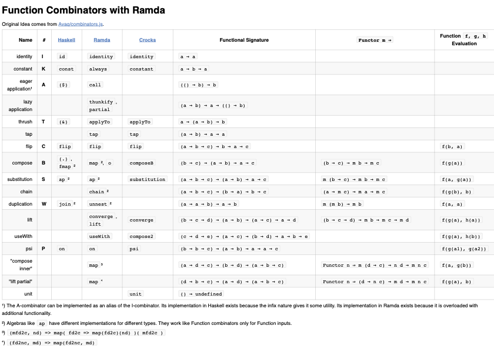

Function 
========
Functions `x → b` can be treated as functors `(→ x) b` (or `Functor f ⇒ f b`). The functor `f` or `(→ x)` represents all functions accepting `x` as argument. 

For an introduction into that concept, explanations and examples see the [article from Tom Harding][THF].

Reader
------
Treating functions as functors for instance makes it possible to compose pipelines of functions which are applied sequentially to their respective return values – as usual – but which are only executed when called with an additional, possibly mutable, argument – usually called "environment". Invoked with just their "primary" pipeline-entry argument, the pipeline is not executed and is thus referentially transparent. The responsibility to permit *reading* from the *environment* is left for the final caller of this so-called *Reader*. This is much like a binary curried function `a => b => someOperation(a, b)` which happens to be the `of` factory for *Reader* `of = x => env => x`.

### `map`
```
map :: Functor f ⇒ (b → c) → f b → f c
map :: (b → c) → (→ a) b → (→ a) c
map :: (b → c) → (a → b) → (a → c)
```

simply compose, really.

Using [Ramda]
----
The Ramda version of the ADT functions `ap`, `map` and `chain` support not only StaticLand (i.e. native JavaScript) List functors (that is: `Array`) but also function functors.

Some function combinators – which are useful for programming in point-free style – can be implemented with help of the ADT functions:

[](img/Useful Combinators in Ramda.pdf)

[Ramda]: http://ramdajs.com/
[THF]: http://www.tomharding.me/2017/04/15/functions-as-functors/
